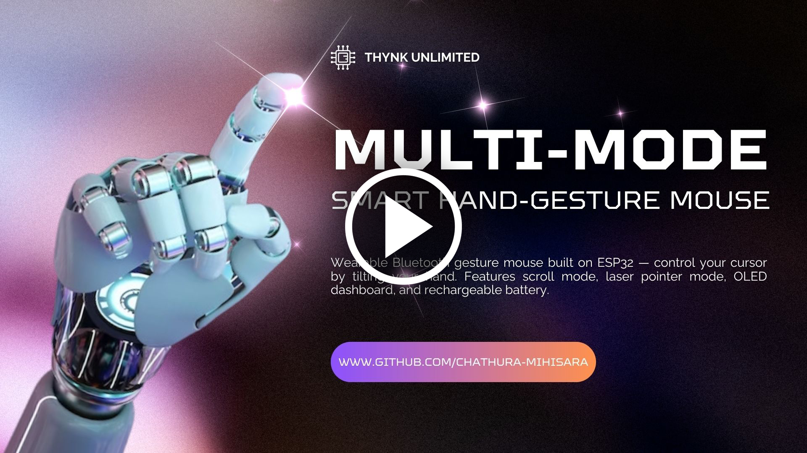

# 🖱️ Multi-Mode Smart Hand-Gesture Mouse

## 📌 Overview

This project is a **Bluetooth-based gesture-controlled mouse** that allows users to control devices using **hand movements and buttons**. It is designed for both **PC and Android mobile devices**, providing a smart and portable interaction system.

---

## ⚙️ Features

* 🖐️ Hand gesture-based cursor movement
* 🔘 Left & Right click buttons
* 🔄 Scroll functionality using hand motion
* 📡 Bluetooth connectivity (PC + Android support)
* 📟 OLED display for status & info
* 🔋 Rechargeable battery system
* 🔦 Laser presentation mode

---

## 🧰 Hardware Used

* ESP32 – Main Controller & Bluetooth HID
* MPU6050 – Gesture Sensor
* OLED Display
* RTC Module (HW-111)
* Laser Module
* 1000mAh Battery + TP4056 Charger
* Left  / Middle / Right / Mode Buttons

---

## 🔌 How It Works

1. The **MPU6050 sensor** detects hand movement.  
2. The **ESP32** processes the motion data.  
3. Cursor movement is generated based on gestures.  
4. Buttons control **left click, right click, scroll mode, and laser mode switching**.  
5. When laser mode is activated, the **laser module turns ON for pointing and presentations**.  
6. The device connects via **Bluetooth** to PC or Android.  
7. OLED display shows connection status, mode, and system info.

---

## 📱 Android Support

This device can also connect to **Android smartphones and tablets** via Bluetooth.
Once connected, it functions as a **wireless gesture mouse**, allowing navigation, scrolling, and interaction just like on a PC.

---

## 🔦 Laser Mode (Presentation Mode)

* Use the **Mode button** to switch modes
* When activated, the **laser module turns ON**
* This mode is useful for **presentations, teaching, and pointing on screens**
* Allows the device to act as a **presentation pointer + mouse combo**

---

## 🔗 Connection Guide

1. Turn on Bluetooth on your PC or Android device
2. Search for the device
3. Select and connect
4. Once connected, the **blinking LED becomes solid** and the OLED display updates

---

## 🎥 Project Demo Video

[](https://youtu.be/A7RdeAjiv5U)

---

## 🚀 Future Improvements

* Add gesture customization
* Improve accuracy using sensor fusion
* Enhance battery life

---

## 📂 Project Structure

```
AirMouseProject/
│
├── AirMouseProject.cpp     
├── AirMouseProject.h      
├── AirMouseProject.ino     
│
├── Final Report.pdf
├── multi-mode-hand-gesture-mouse.jpg        
├── README.md               
├── LICENSE                 
```

---

## 📜 Copyright

© 2026 H.K.Chathura Mihisara. All rights reserved.
This project and its contents are protected. Unauthorized use, copying, or distribution without permission is prohibited.

---

